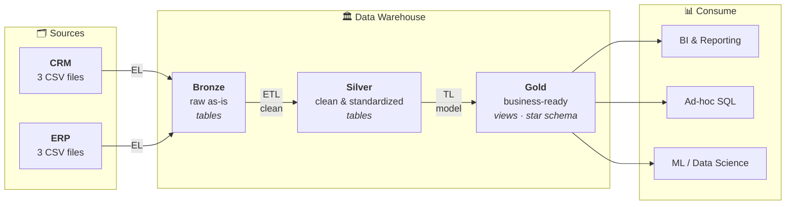

# Data Architecture

**Pattern:** Medallion (bronze → silver → gold), with a Kimball star schema in gold.

Medallion decides *where data sits and how clean it is*. Kimball decides *what shape gold takes*.
They compose — they are not competing choices.

## Why this pattern

| Candidate | Verdict |
|---|---|
| **Medallion** | **Chosen.** Layer-per-quality-level. Simple to explain, trivial to debug (a wrong number is traceable to one layer), no doctrine to over-apply at this size. |
| Kimball | Adopted *inside* gold as the modeling style — star schema, conformed dimensions. |
| Inmon | Rejected. An enterprise-wide 3NF layer is heavy overkill for two source systems, and delays first value by months. |
| Data Vault | Rejected. Its entire value proposition is historization and auditability — explicitly out of scope per the brief. |

## The flow



Note the transformation split across the hops — **EL** into bronze (no transform), **ETL** into
silver (the cleansing), **TL** into gold (the modeling). Transformation is distributed, not done in
one leap.

## Layer specifications

| | **Bronze** | **Silver** | **Gold** |
|---|---|---|---|
| **Definition** | Raw, unprocessed data as-is from sources | Clean & standardized data | Business-ready data |
| **Objective** | Traceability & debugging | Prepare data for analysis | Consumption for reporting & analytics |
| **Object type** | Tables | Tables | **Views** |
| **Load method** | Full load — truncate & insert | Full load — truncate & insert | None (computed on read) |
| **Transformations** | **None (as-is)** | Cleaning, standardization, normalization, derived columns, enrichment | Integration, aggregation, business logic & rules |
| **Data modeling** | **None (as-is)** | **None (as-is)** — source-shaped, same grain | Star schema, aggregated objects, flat tables |
| **Audience** | Data engineers | Data analysts, data engineers | Data analysts, business users |

## Architecture rules

These are the invariants. Everything else is implementation detail.

1. **Each layer reads only from the layer immediately below it.** Gold never touches bronze. Silver
   never re-reads the CSVs.
2. **Bronze is never transformed** — not even a `TRIM`. Its value is being byte-identical to the
   source; the moment it isn't, it stops being a trustworthy place to debug from.
3. **Silver does not remodel.** One source row in, one row out. Same grain, source-shaped tables.
   All joining and reshaping happens on the jump to gold.
4. **Gold is the only public interface.** Nothing outside the warehouse queries bronze or silver.
5. **Every layer is fully rebuildable** from the layer below, by re-running one procedure.

Rules 1–3 are separation of concerns applied literally: one job per layer, one thin interface
between adjacent layers, no connections that skip a boundary.

## ETL profile

The choices made from the ETL decision space, given the brief:

| Dimension | Choice | Why |
|---|---|---|
| Extract — type | **Full extraction** | No historization required; the whole dataset is re-read every run. |
| Extract — method | **Pull** | The warehouse reaches for the files; sources push nothing. |
| Extract — technique | **File parsing** | Sources are CSV files, not databases or APIs. |
| Transform | Cleansing, standardization, normalization, derived columns, enrichment (silver); integration, aggregation, business rules (gold) | Per layer spec above. |
| Load — processing | **Batch** | Whole-dataset refresh, run on demand. No streaming requirement. |
| Load — method | **Full load, truncate & insert** | Simplest correct option when history isn't kept. |
| Load — SCD | **SCD 1 / SCD 0 (overwrite)** | Brief: *"historization of data is not required."* |

What this deliberately excludes: incremental extraction, CDC, event streaming, watermarks,
merge/upsert logic, and SCD 2 validity ranges. All out of scope — do not add them speculatively.

## Physical layout

One database, three schemas — `bronze`, `silver`, `gold`. Schema separation (rather than one schema
with name prefixes) makes the boundary enforceable and the layer of any object obvious from its
fully-qualified name.

```
warehouse
├── bronze    crm_cust_info, crm_prd_info, crm_sales_details,
│             erp_cust_az12, erp_loc_a101, erp_px_cat_g1v2
├── silver    same six table names, cleaned
└── gold      dim_customers, dim_products, fact_sales
```

Silver mirrors bronze's table names on purpose: the same object at a different quality level, so a
diff between layers is a diff in *cleanliness*, not in naming.

## Open

- **Engine** — brief specifies SQL Server; PostgreSQL 15 is running locally and Docker is available.
  Architecture above is engine-independent.
- **Source CSVs** — not yet in `datasets/`. Final bronze table list may shift once the real files
  are inspected.
